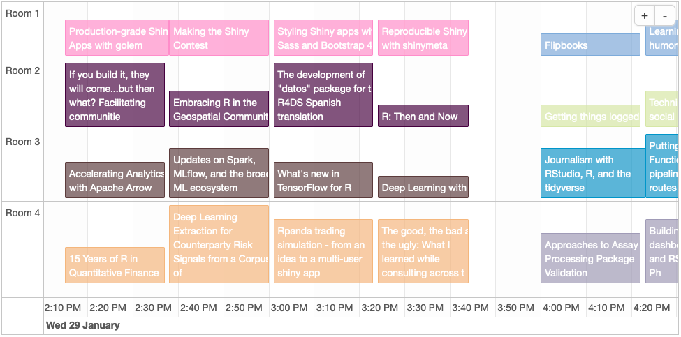
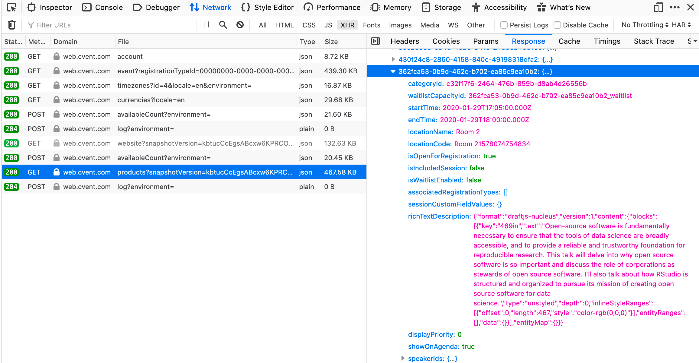
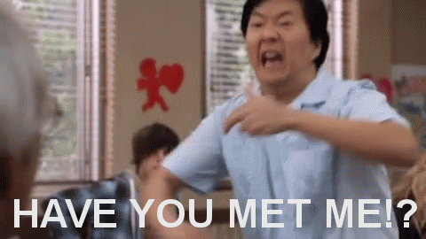
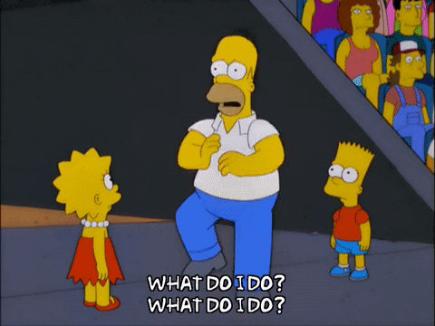
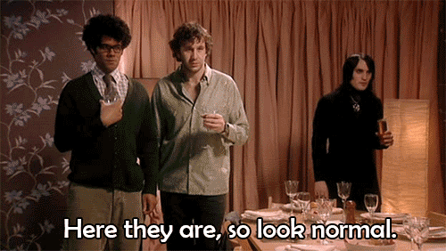
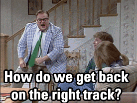

# Intro

The [RStudio conference](https://rstudio.com/conference/) (cleverly named `rstudio::conf`) is coming up at the end of
January.  This is the first time I'll be attending, and I'm really looking forward to it!

There will be four concurrent presentations during most of the two main days of the conference (Jan 29th and 30th).
Unfortunately, it's a little challenging to visualize the schedule and pick which talk to attend using the
[official conference agenda page](https://web.cvent.com/event/36ebe042-0113-44f1-8e36-b9bc5d0733bf/websitePage:34f3c2eb-9def-44a7-b324-f2d226e25011).

Mara Averick ([`@dataandme`](https://twitter.com/dataandme)) tweeted about a
[handy pdf](https://envelop.app/d/maraaverick/Av2QYN!TbmuIJTY4G07bILA) she created that lays out the schedule of talks.

```{r echo=FALSE}
blogdown::shortcode('tweet', '1199327455405850625')
```

I came across her tweet one `r "\U0001f407 \U0001f573"` too late, however `r "\U0001f926"`. Prior to that discovery I
had decided it would be "fun" to inspect the conference agenda page, see what it would take to scrape the details for
all the presentations, and try to display them in a nicer format.
[Yada, yada, yada](https://www.youtube.com/embed/O6kRqnfsBEc?start=0&end=48), here's a blog post for ya.

Before this thing is over, you'll (hopefully) learn how
**use R to create an interactive schedule of the conference talks** that looks like this:


# Setup

## Packages

Let's start by loading some packages. I like to use the [`pacman` package](https://github.com/trinker/pacman) from
Tyler Rinker ([`@tylerrinker`](https://twitter.com/tylerrinker)) to handle things.  The `p_load` function takes
a vector of package names, installs them if necessary, and then loads them.

```{r message=FALSE, warning=FALSE}
pkgs <- c("ggplot2", "ggsci", "jsonlite", "magick", "magrittr", "rmarkdown",
          "robotstxt", "scales", "splashr", "timevis", "urltools", "data.table")

pacman::p_load(char=pkgs)
```


## Page rendering tool

We'll use the [`splashr` package](https://gitlab.com/hrbrmstr/splashr) from Bob Rudis
([`@hrbrmstr`](https://twitter.com/hrbrmstr)) to load the page and grab the content we need, all from the comfort of R.

Why do we need this?  As usual the great R community `r "\U0001f64c"` has developed many
[packages for web-related tasks](https://cran.r-project.org/web/views/WebTechnologies.html).  The
[`rvest` package](https://github.com/tidyverse/rvest) is one that can be very useful in certain situations.  But many
times our old pal Javascript is invited to the party and
[adds some complications](https://datascienceplus.com/scraping-javascript-rendered-web-content-using-r/) that require a
tool like [Splash](https://splash.readthedocs.io/en/stable/) that can render it.  The `splashr` package looks well
supported and it's relatively new so I wanted to give it a spin.

You can read through the [splashr intro vignette](https://cran.r-project.org/web/packages/splashr/vignettes/intro_to_splashr.html),
but it's pretty straightforward to get started.  Just [install docker](https://docs.docker.com/install) if you haven't
already and then run `install_splash()` in R.

Now let's fire up a Splash docker container, which will be the thing that does the thing (i.e. scrape the page).

```{r}
spCon <- start_splash()
```

<br>
I didn't have problems running this initially, but for whatever reason when I went to make this post it started
complaining a little about the (docker?) API version. Hopefully it works for those of you following along at home! You
can check the status with the following function.

```{r}
splash_active()
```


## Check robots.txt

Now that we've made a splash `r "\U0001f644"`, let's specify the URL of the conference agenda page that we'll be
scraping and check the page's [robots.txt](https://en.wikipedia.org/wiki/Robots_exclusion_standard).  Use the handy
and aptly named [`robotstxt` package](https://github.com/ropensci/robotstxt) from Peter Meissner
([`@peterlovesdata`](https://twitter.com/peterlovesdata)) to make sure it's ok to scrape the event page.

```{r message=FALSE, warning=FALSE}
## Page to scrape
urlConf <-
  "https://web.cvent.com/event/36ebe042-0113-44f1-8e36-b9bc5d0733bf/websitePage:34f3c2eb-9def-44a7-b324-f2d226e25011"

## Parse the domain
urlDomain <- urltools::domain(urlConf)

## Get the robots.txt file
rt <- get_robotstxt(urlDomain)

## Check robots.txt
pa <- paths_allowed(domain=urlDomain)

rt
pa
```

The output of `paths_allowed` is `r pa`, so we've got the "all clear" to scrape this thing.  Responsibly, of course.


# Scrape

## Load the page

We can fetch the page and all its accouterments using the `splashr::render_json` function. I initially set a `wait`
value of 3 seconds, which apparently was not enough time for the page to load on my machine; YMMV.  If you want to see
an image of the rendered page (hopefully after it's fully loaded), you can set the PNG argument to `TRUE` and then
display it with `magick::image_read`.

```{r screen-scrape, cache=TRUE}
## Load the page and take a screenshot
pg <- render_json(url=urlConf, wait=5, png=TRUE, response_body=TRUE)
#pg$html

## Show the screenshot
#render_png(url=urlConf, wait=3) ## Alt method, if you just want the screenshot and nothing else
pgPNG <- image_read(base64_dec(pg$png))
pgPNG
```


## Examine the content

We've got everything set up, so now we need to become familiar with the structure and content of the page we're
scraping.  (IRL, you'd want to *start* by investigating the page and *then* determine which tools to use to scrape it,
but as your cheesy cooking show host I've already pre-baked that part for this blog post.)  Load the
<a href="`r urlConf`" target="_blank">conference agenda page</a> in your desktop browser, open the
[web development tools](https://en.wikipedia.org/wiki/Web_development_tools), and go to the network tab. (The keyboard
shortcut to the network tab in Firefox is <kbd>&#8984;</kbd>+<kbd>&#8997;</kbd>+<kbd>E</kbd> on macOS and
<kbd>Ctrl</kbd>+<kbd>Shift</kbd>+<kbd>E</kbd> in Windows/Linux.) You'll likely want to clear the existing results and
reload the page.

We could try to scrape the rendered HTML, but it seems that the content for each session is only revealed after clicking
on the session.  We could probably do that with Splash, but there is an easier option.  I had a hunch that the
conference session details would be stored in a JSON file, and that turned out to be correct.  Filter (by selecting XHR)
or sort the network results by type and look for a JSON file with "products" in the name.  Check the response tab, which
contains the formatted contents of the file.

<br>

<br>
<div style="margin:auto; width:480px;">
<a href="https://giphy.com/gifs/seinfeld-giddyup-rPO52Fc8gSwzS">
  
  <figcaption></figcaption>
</a>
</div>
<br>


## Get the JSON

If you're just tuning in, we know the JSON with the conference session details is out there `r "\U0001f47d"`.  Our
friend `splashr` saved an [HTTP archive (HAR)](https://en.wikipedia.org/wiki/HAR_(file_format)) for us
[earlier](#load-the-page), so we can grab it from that.  But first we need to find it.  Take a look at the HAR object.

```{r}
## Get the HTTP ARchive (HAR) file that contains a list of page resources

## Alt method if you just want the HAR and nothing else:
#har <- render_har(url=url, wait=3, response_body=TRUE)

har <- pg$har
har
```

<br>
Gowrgeous, isn't it?  Before I start to get emotional or even a little
[verklempt]((https://www.youtube.com/embed/oiJkANps0Qw?start=144&end=165)), let's let the computers tawlk amongst
themselves and find the JSON file fowr us.

<div style="margin:auto; width:480px;">
<a href="https://giphy.com/gifs/coffee-talk-verklempt-linda-richman-l2SpQRuCQzY1RXHqM">
  
  <figcaption></figcaption>
</a>
</div>
<br>


### Session

The chunk of R code below ~~loops~~ lapplys through all the entries in the HAR log (`har$log$entries`), looks for JSON
files (`x$response$content$mimeType %like% "json"`) that contain "products" in the name
(`x$response$url %like% "products"`), and returns the indices for those matching files (`which`).

```{r}
## Determine the index for the JSON file containing the conference session details
sessionIdx <-
  lapply(har$log$entries, function(x)
  x$response$content$mimeType %like% "json" & x$response$url %like% "products"
) %>%
  unlist %>%
  which

sessionIdx
```

<br>
Now we can get the text from the response for item `r sessionIdx` (the products JSON file) from the HAR.  Let's also use
the awesome [`data.table` package](https://rdatatable.gitlab.io/data.table/) created by Matt Dowle
([`@mattdowle`](https://twitter.com/mattdowle)) to reformat the JSON into a table.  There are a few naughty nested
JSON elements that don't add much value (`fees` and `associatedRegistrationTypes`) that I'm removing here.

```{r}
## Get the JSON
sessionJSON <-
  har_entries(har)[[sessionIdx[1]]] %>% 
  get_response_body("text")

## Convert from JSON to data.table
session <-
  fromJSON(sessionJSON)$sessionProducts %>%
  lapply(function(x) {
    #as.data.table(x[!lapply(x, length) > 1L]) ## Drop any columns with more than one row per session
    as.data.table(x[!names(x) %chin% c("fees", "associatedRegistrationTypes")]) ## Drop specific columns
  }) %>%
  rbindlist(fill=TRUE)
```

Let's look at the structure of the resulting table.

```{r}
## Print the table; takes up too much space for this blog
#rmarkdown::paged_table(session)

## Examine the structure of a row in the table
exampleId <- "d8d901d9-bdb6-4392-83a9-3ad5addbbf53"
str(session[id==exampleId])
```

Still a bit of an eyesore, but it's in a tabluar and mostly-tidy format, so we can work with it.


### Speaker

The speaker name, bio, and other info is stored in a separate JSON file.  The code below finds and retrieves the
file in a similar fashion as the [session info](#session).

```{r}
speakerIdx <-
  lapply(har$log$entries, function(x)
    x$response$content$mimeType %like% "json" & x$response$url %like% "Sessions"
  ) %>%
  unlist %>%
  which

## Get the JSON
speakerJSON <-
  har_entries(har)[[speakerIdx[1]]] %>% 
  get_response_body("text")

## Convert from JSON to data.table
speaker <-
  fromJSON(speakerJSON)$speakerInfoSnapshot$speaker %>%
  lapply(as.data.table) %>%
  rbindlist(fill=TRUE)

## Print the table; takes up too much space for this blog
#rmarkdown::paged_table(speaker)

## Examine the structure of a row in the table
str(speaker[1])
```


### Category

We need one final JSON file containing the category info for the sessions.

```{r}
categoryIdx <-
  lapply(har$log$entries, function(x)
    x$response$content$mimeType %like% "json" & x$response$url %like% "account"
  ) %>%
  unlist %>%
  which

## Get the JSON
categoryJSON <-
  har_entries(har)[[categoryIdx[1]]] %>% 
  get_response_body("text")

## Convert from JSON to data.table
category <-
  fromJSON(categoryJSON)$sessionCategories %>%
  lapply(as.data.table) %>%
  rbindlist(fill=TRUE)

## Print the table; takes up too much space for this blog
#rmarkdown::paged_table(category)

## Examine the structure of a row in the table
str(category[3])
```


# Prepare

Ok, that was a decent amount of work, but surely *now* we're ready to do something more exciting, right?  Right?
`r "\U0001f997"`

```{r echo=FALSE}
blogdown::shortcode('tweet', '306596352991830016')
```


## Convert dates/times

We want to know the dates and times of the rstudio::conf sessions, but they're currently stored as text in the tables
we've scraped.  Since the event is in San Fran, we also want to display the time using the US/Pacific time zone rather
than UTC.  There are multiple date/time columns, so we can loop through them and apply the same transformation to each.

The code below converts all columns with "time" in the name.  I use `data.table` all the time, but it took a few
trips to Google and re-finding [this Stackoverflow answer](https://stackoverflow.com/a/16846530/1344789) before I
eventually remembered the syntax for applying a function to each column in a table.  Also, we could probably use
[`lubridate`](https://lubridate.tidyverse.org/) to make the date/time conversion a little easier, but I'm feeling
complicated.

<div style="margin:auto; width:480px;">
<a href="https://media.giphy.com/media/abJQukJ1NIAHS/giphy.gif">
  
  <figcaption></figcaption>
</a>
</div>
<br>

```{r}
## Function to convert a string to POSIXct and change the timezone format
dateTimeConvert <- function(x, fmt, tzOrig, tzNew) {
  
  .POSIXct(as.integer(as.POSIXct(x, format=fmt, tz=tzOrig)), tz=tzNew)
  
}

cols <- names(session)[names(session) %like% "[Tt]ime"]
cols

## Convert timestamps from UTC to Pacific
for(n in cols)
  set(session, j=n, value=dateTimeConvert(session[[n]], "%FT%T", "UTC", "US/Pacific"))

## Examine the structure of the date/time columns
str(session[, mget(cols)])
```


## Add category name and style
[A few steps ago](#category), we grabbed a JSON file containing the session categories.  In
[a few steps from now](#visualize), we'll color code each session/talk based on the category.  Here is an example:

<p><div style="width: 120px; height: 30px; line-height: 30px; text-align: center; color: white; background-color: rgba(54, 3, 53, 0.7); border-color: rgb(54, 3, 53)">R: Then and Now</div></p>

Let's prep for that by creating a color palette and assigning a color to each session.  The
[`ggsci` package](https://github.com/nanxstats/ggsci) from Nan Xiao ([`@nanxstats`](https://twitter.com/nanxstats)) et
al. has some nice color palettes.  The Springfield collection from the Simpsons&trade; palette has a max of 16 colors,
but it turns out there are `r category[, uniqueN(id)]` categories in the rstudio::conf data.

<p>
<div style="margin:auto; width:480px;">
<a href="https://media.giphy.com/media/l2JeccUjGIeaxT9du/giphy.gif">
  
  <figcaption></figcaption>
</a>
</div>
</p>

<br>
Not to worry, we can use `grDevices::colorRampPalette` to interpolate as many colors as we need.

```{r}
nColorsMax <- 16

## How many colors do we need?
nColors <- nrow(category)

## Create the palette
styleColors <- colorRampPalette(ggsci::pal_simpsons("springfield")(min(c(nColors, nColorsMax))))(nColors)

## Examine what we've got
scales::show_col(styleColors)
```

That'll do.  Now we need to create a little [CSS](https://en.wikipedia.org/wiki/Cascading_Style_Sheets) to style the
colors for the border, background, and text of the session info boxes.  For the border we can use the colors from the
palette we created.  To differentiate it from the border color, let's set the transparency of the background color to
70%.  One quick hack--that [may not work in all browsers](https://caniuse.com/#feat=css-rrggbbaa)--is to add the
transparency (alpha) value at the end of the normal hex color value.  For example,
<span style="color:white; background-color:rgb(54, 3, 53)">#360335</span> would become
<span style="color:white; background-color:rgb(54, 3, 53, 0.7)">#360335<span style="text-decoration: underline;">B3</span></span>.
(`B3` is the hex representation for 70%.)  For the text let's go with white, since most of the palette colors are on the
darker side.

The code below adds a style column to the category table that specifies the CSS to use for each category.  Then it adds
the category name and style columns from the category info table to the session table, joining on the id columns.  (Here
and elsewhere throughout the post I am using the `data.table` package to wrangle data.  Check the
[intro vignette](https://cran.r-project.org/web/packages/data.table/vignettes/datatable-intro.html) if you're
unfamiliar with the syntax.)

```{r}
alpha <- 0.7
alphaHex <- 
  median(c(alpha, 0, 1)) * 256 %>% ## Make sure alpha is between 0 and 1, and multiply by 256
  as.integer %>% ## Convert to a whole number
  as.hexmode ## Convert to hexadecimal

## Add the CSS style column
category[, style:=sprintf(
  "color: white; background-color: %1$s%2$s; border-color: %1$s;", styleColors, alphaHex)]

## Add the category name and style to the session table
session[category, `:=`(categoryName=i.name, style=style), on=c(categoryId="id")]
```


## Split out list columns

Our JSON files had some nesting that we've so far ignored.  Let's rectify that by splitting out those list columns
(which currently have multiple rows per row in the main table) into their own tables.

```{r}
## This table links the session to the speaker(s)
sessionSpeakerId <-
  session[, .(rbindlist(speakerIds))] %>%
  unique ## Remove duplicate rows

## Print a few rows
#rmarkdown::paged_table(sessionSpeakerId[1:5])

## Examine the structure 
#str(sessionSpeakerId)

## Column names
names(sessionSpeakerId)

## This table contains links to social media and other types of pages for the speakers
speakerLink <-
  speaker[, .(rbindlist(websites))] %>%
  unique ## Remove duplicate rows

## Print a few rows
#rmarkdown::paged_table(speakerLink[1:5])

## Examine the structure
#str(speakerLink)

## Column names
names(speakerLink)
```


## Speaker info for each session

We will [eventually](#take-2) create a bunch of boxes containing the session name, but to be more informative we'll want
to add popup messages that provide more details for each session, including info about the speaker.  The code below
contains a function that combines the company and title for each speaker, handling cases where one or the other or both
are missing.

```{r}
## Format the speaker's combined title and company
titleCompany <- function(company, title) {
  
  ## Replace semicolon with slash in title, since we'll use semicolon to delimit multiple speakers later
  title <- gsub("; ", " / ", title)
  
  ## Convert NA to empty string
  if(is.na(title)) title <- ""
  if(is.na(company)) company <- ""
  
  ## Check for empty string
  valT <- title==""
  valC <- company==""
  
  ## If both are empty, return empty
  if(all(c(valT, valC))) return("")
  
  ## Combine the company and title
  val <-
    if(any(c(valT, valC))) paste0(title, company) else
      paste(c(title, company), collapse=", ")
  
  ## Wrap in parenthesis
  return(sprintf("(%s)", val))
}
```

The `sessionSpeakerId` table that we [split out in the previously](#split-out-list-columns) lets us relate the speaker
to the session.  Let's use it now to merge those two tables.  While we're at it, we'll use that speaker title/company
function to format the speaker info.  If there are multiple speakers per session, we'll collapse it into a single text
value separated by a semicolon.

```{r}
## Add the session and category identifiers to the speaker table
## The result contains one row per combination of session and speaker
sessionSpeaker <- merge(sessionSpeakerId, speaker, by.x="speakerId", by.y="id")

sessionSpeakerInfo <-
  ## Select the columns we need
  sessionSpeaker[, .(sessionId, speakerId, firstName, lastName, title, company)] %>%
  
  ## Remove duplicates
  unique %>%
  
  ## Format the speaker info
  .[, speakerInfo:=trimws(paste(firstName, lastName, titleCompany(title, company))), by=.(sessionId, speakerId)] %>%
  
  ## Collapse multiple speakers into a single semicolon-delimited value
  .[, .(speakerInfo=paste(unique(speakerInfo), collapse="; ")), by=.(sessionId)]

sessionSpeakerInfo[, .(speakerInfo)]
```

Now we can add the speaker info to the session table.

```{r}
session[sessionSpeakerInfo, speakerInfo:=speakerInfo, on=c(id="sessionId")]
names(session)
```


## Identify workshops vs talks

Conference attenders can sign up for two-day workshops on Jan 27th and 28th.  For the purposes of this post though, we
only care about the talks on the 29th and 30th.  (Remember the [intro](#intro), from like 30 minutes ago?  We're trying
to make a friendlier display of the schedules so we can choose which of the four concurrent sessions to attend.)

How can we classify the session info into "workshop" vs "talk", using only the text descriptions?!  This is a job for
[`BERT-Large`](https://github.com/google-research/bert)!  Or--if you fancy the uncased case--`bert-large`.

Sorry for the anti-climax, but it turns out that the workshops don't have room location information while
the talks do; no need for any fancy NLP here.  Also, we could have just filtered by date `r "\U0001f609"`.  But
seriously, someone needs to create a state-of-the-art-for-this-nanosecond transformer called SUPER-GROVER&trade;.

<a href="https://imgflip.com/i/3lutqq"></a>

Using that breakthrough insight, let's subset the session info to only those rows that have location data.  The code
below also grabs the global session identifier, start and end times, class name and description, location, and speaker
info.  We'll use these columns for our final output.  We'll also do one last check for duplicate rows.

```{r}
## Subset the talks, select the relevant columns, and de-duplicate
talks <-
  session[!is.na(locationName), .(
    id, startTime, endTime, categoryName, name, description, locationName, speakerInfo, style)] %>%
  unique

## Make sure there aren't any dupes left
talksCheckDupes <- talks[, .N, by=id][N>1]
if(nrow(talksCheckDupes) > 0) warning("There are multiple rows with the same identifier!")
```


## Format talk titles

Judging from the length of the talk titles (and this blog post), the R community can be pretty wordy at times!  Congrats
to "`r talks[, .(name, nameLength=nchar(name))][order(-nameLength)][1, name]`" for being the longest title.  It looks
like they actually `r "\U00002702"` off titles at 100 characters.

```{r out.width='100%'}
ggplot(talks[, .(nameLength=nchar(name))], aes(x=nameLength)) +
  geom_histogram(binwidth=2) +
  labs(x="Number of characters in session title", y="Count") +
  theme_minimal(base_size=18)
```

While informative, the long titles are a challenge to display compactly.  For the schedule visualization tool we'd like
to reshape the text a bit, breaking long titles into multiple rows. We can use `strwrap` to split the text at word
boundaries, inserting a line break after 20 characters (a value chosen after trial and error).

```{r}
maxWidth <- 20

#talks[, nameWrap:=substr(paste(strwrap(name, width=maxWidth), collapse="\n"), 0, maxWidth*3)]
## Break it
talks[, nameWrap:=
        name %>% ## Original session name
        strwrap(width=maxWidth) %>% ## Wrap it
        .[1:4] %>% ## Allow up to 4 rows
        na.omit %>% ## Remove blank rows if there are fewer than 4
        paste(collapse="\n"), ## Collapse multiple lines into one, separated by a line break
        by=name]
```

Let's check to make sure it worked.

```{r}
## Check it
talksCheck <- talks[, .(name, nameWrap, nameLength=nchar(name))][order(-nameLength)]

## Compare the unwrapped and wrapped versions
unwrapped <- talksCheck[1, cat(name)]
wrapped <- talksCheck[1, cat(nameWrap)]
```


## Find overlapping times

Since we're dealing with data here `r "\U0001F92A"`, it could be interesting to check for cases where multiple sessions
are scheduled at the same time and location.  Using the `data.table::foverlaps` function, we can easily and quickly join
the table of talks to itself on the room location and start/end times and look for overlaps.  First we set the key
columns that will be used in the join, making sure that the start and end times are the last two keys specified (as
required by `foverlaps`).  Then we subset the results to remove cases where the session names being compared are
identical, since we don't want to compare a talk to itself.  In other words, we already know that Talk A is happening at
the same time and place as Talk A.

```{r}
## Select relevant columns
allTalks <- talks[, .(locationName, startTime, endTime, name, speakerInfo)]

## Set the keys for the table
setkey(allTalks, locationName, startTime, endTime)

## Find the overlapping times
overlaps <- foverlaps(allTalks, allTalks, type="within")[name!=i.name][order(locationName, startTime, name)]

## Clean up the names
#setnames(overlaps, gsub("i\\.", "overlapping\\.", names(overlaps)))
overlaps[, mget(names(overlaps)[!names(overlaps) %like% "i\\."])]
```

Uh oh.  It might get a little awkward when the Effective Visualization crowd shows up to the RMarkdown party in Room 2
on Thursday at 11:16.

<div style="margin:auto; width:480px;">
<a href="https://media.giphy.com/media/g7QIkzEDTEWKA/giphy.gif">
  
  <figcaption></figcaption>
</a>
</div>
<br>


# Visualize

## Take 1

Now we're finally ready to do something useful-ish!  `r "\U0001f928"`  Let's use the `geom_rect` function from the
[`ggplot2` package](https://ggplot2.tidyverse.org/) to plot each talk session as a rectangle.  On the x-axis the box
will stretch from the start time to the end time.  Room locations will be represented by different y-axis positions.
The name of the talk will be labeled with `geom_text`.  Flip the switch and let's see what we've got!

<div style="margin:auto; width:480px;">
<a href="https://media1.giphy.com/media/3o6wrr3Vk5g3NnuASY/giphy.gif">
  
  <figcaption></figcaption>
</a>
</div>
<br>


```{r out.width='100%'}
p1 <-
  ggplot(talks, aes(
  ymin=as.ITime(startTime), ymax=as.ITime(endTime),
  xmin=as.numeric(factor(locationName))-0.45, xmax=as.numeric(factor(locationName))+0.45)) +
  geom_rect(fill="white", color="black") +
  geom_text(aes(
    y=as.ITime(startTime + (endTime-startTime)/2), x=as.numeric(factor(locationName)),
    label=substr(name, 0, 30)), angle=0) +
  scale_y_continuous(trans="reverse") +
  facet_wrap(~as.IDate(startTime), ncol=1)

p1
```

<div style="margin:auto; width:480px;">
<a href="https://media.giphy.com/media/67SXeoc8RLwvqCwn2F/giphy.gif">
  
  <figcaption></figcaption>
</a>
</div>
<br>

Ok, so it might need some "finessing".  I promise it looked better full screen on a 4K monitor `r "\U0001f91e"`.  But
only a little.


## Take 2

Let's see if we can do better...

<div style="margin:auto; width:480px;">
<a href="https://media.giphy.com/media/MF3fDJIFZ0ORO/giphy.gif">
  
  <figcaption></figcaption>
</a>
</div>
<br>

`ggplot2` has amazing superpowers for most data visualization tasks, and we could try to tweak our first take to make it
more readable.  But it's probably better in this case to switch to another tool that is more interactive and
"web native".  I investigated using [`ggiraph`](https://github.com/davidgohel/ggiraph) and
[`Plotly`](https://plot.ly/r/); while they are both nice packages and good at what they do, they weren't quite suited
for this task.

```{r eval=FALSE, include=FALSE, out.height='5000px', out.width='95%'}
p2 <-
  ggplot(talks, aes(
  ymin=as.ITime(startTime), ymax=as.ITime(endTime),
  xmin=as.numeric(factor(locationName))-0.45, xmax=as.numeric(factor(locationName))+0.45, tooltip=name)) +
  #geom_rect(fill="white", color="black") +
  ggiraph::geom_rect_interactive(fill="white", color="black") +
  #geom_text(aes(
  #  y=as.ITime(startTime + (endTime-startTime)/2), x=as.numeric(factor(locationName)),
  #  label=nameWrap), angle=0) +
  scale_y_continuous(trans="reverse") +
  labs(x="Room", y=NULL) +
  facet_wrap(~as.IDate(startTime), ncol=1) +
  theme_minimal()

p2
#plotly::ggplotly(p2 %>% config(displayModeBar=FALSE), tooltip="name")
```

After more searching, I came across the [`timevis` package](https://github.com/daattali/timevis).  According to the
package creator Dean Attali ([`@daattali`](https://twitter.com/daattali)), it is "based on the
[vis.js](http://visjs.org) Timeline module and the [`htmlwidgets`](http://www.htmlwidgets.org) R package."  (Dean also
created [beautiful-jekyll](https://github.com/daattali/beautiful-jekyll), the basis for
[the Hugo template](https://themes.gohugo.io/beautifulhugo/) I'm using for this blog.  Thanks Dean!)  Let's give it a
try!

We'll still use the `talks` table, but `timevis` requires a second table with grouping information.  In our case, the
groups are the room locations.  So before plotting anything, let's get the room info in a separate table.

```{r}
rooms <-
  talks[, .(id=locationName, content=locationName, order=as.numeric(factor(locationName)))][
    order(order)] %>%
  unique
#rooms[, style:=sprintf(
#  "color: %s; background-color: %s;",
#  ggsci::pal_simpsons("springfield")(nrow(rooms)),
#  ggsci::pal_simpsons("springfield", alpha=0.3)(nrow(rooms)))]
```

Finally, we're ready to create the visualization for the talk schedule.  I won't explain every bit of the code to create
the output, since the `timevis` [documentation and examples](https://github.com/daattali/timevis) are pretty good.  I
did spend a fair amount of time poring over the vis.js docs, especially the
[configuration options](https://visjs.github.io/vis-timeline/docs/timeline/#Configuration_Options) and
[examples](https://visjs.github.io/vis-timeline/examples/timeline/), trying to determine
how to translate the Javascript instructions into R.

```{r}
hoverTemplate <-
"Category: %s
Title: %s
Time: %s to %s
Speaker(s): %s

%s"

tv <-
  timevis(
  talks[, .(
    id,
    start=startTime,
    end=endTime,
    title=sprintf(hoverTemplate,
                  categoryName, ## Category
                  name, ## Title
                  format(startTime, "%I:%M%p"), format(endTime, "%I:%M%p"), ## Time
                  speakerInfo, ## Speaker
                  gsub("<.*?>", "", (description)) ## Description
    ),
    content=gsub("\\n", "<br>", nameWrap),
    group=locationName,
    type="range",
    style)],
  groups=rooms,
  options=list(
    stack=FALSE, stackSubgroups=FALSE, horizontalScroll=TRUE, zoomKey="ctrlKey", width="100%",
    format=list(minorLabels=list(minute="LT", hour="LT")),
    end="2020-01-29 11:00:00", hiddenDates=list(start="2020-01-29 18:00:00", end="2020-01-30 08:00:00")
  )
)
```


# Final result

<hr>
```{r output, echo=FALSE, out.width='100%'}
tv
```

<span style="font-size: xx-large;">`r "\U00002139"`</span>

> - Hover over a session to get more info about the session and the speaker.
> - Click and hold your mouse inside the schedule window, and them move your mouse left or right to scroll through
additional dates/times.
> - Press the +/- buttons to zoom in or out on the schedule.

<p />
<hr>
We could make this fancier by adding buttons to jump to specific time ranges, a dropdown to select the times for a
specific session, etc.  But... let's just take the win, go home, and eat some spaghetti with syrup to celebrate!

<div style="margin:auto; width:480px;">
<a href="https://media.giphy.com/media/slOhiKAVFgwr6/giphy.gif">
  
  <figcaption></figcaption>
</a>
</div>
<br>
