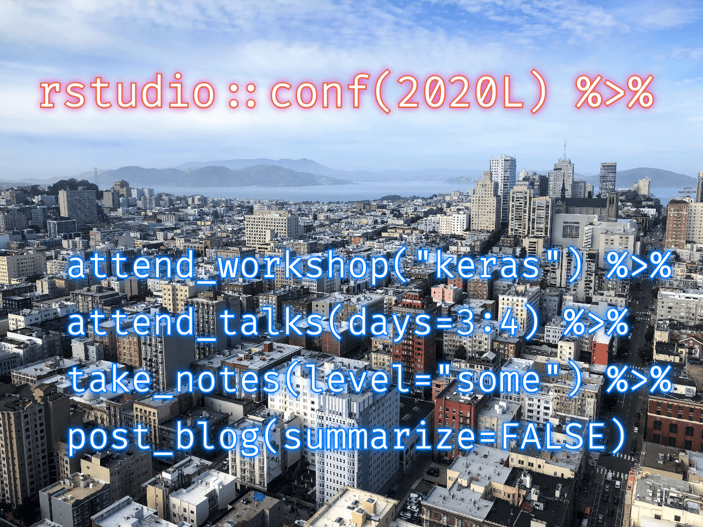

 

<figcaption>*View of the city and the bay from the top floor of the hotel where the conference was held &copy; 2020 Dan LaBar*</figcaption>

I had the good fortune to attend the RStudio Conference in San Francisco last week.  It was a great experience!

Unfortunately, after being away from my day job for a week, I have quite a bit of catching up to do and not enough time to blog about what I saw and learned at the conference.  I did however try to take notes during [all the talks](../2020-01-20-schedule-for-rstudio-conf-2020l-talks) I attended, so I'm posting them here with the hopes of eventually coming back and pulling out some summaries of the most interesting parts.

You can follow along with the code from all of the 2-day workshops at [github.com/rstudio-conf-2020](https://github.com/rstudio-conf-2020), and the presentation videos from the third and fourth days should eventually be posted at [resources.rstudio.com/rstudio-conf-2020](https://resources.rstudio.com/rstudio-conf-2020).  In the meantime, [Emil Hvitfeldt](https://twitter.com/Emil_Hvitfeldt) and friends have collected links to slides and other resources at [github.com/EmilHvitfeldt/RStudioConf2020Slides](https://github.com/EmilHvitfeldt/RStudioConf2020Slides).  The cmdline site has also collected [tweets from presenters sharing links to their presentation slides](https://cmdlinetips.com/2020/01/slides-from-rstudio-conference-2020/).

# Day 3 sessions (2020-01-29)

## Open Source Software for Data Science
- Speaker: JJ Allaire [fly_upside_down](https://twitter.com/fly_upside_down)
- [Slides](https://rstudio.com/slides/rstudio-pbc)
- *It'll be better to just watch the video when it comes out*, but here is his overview
  - Origins of RStudio
  - Why free and open source software?
  - Tools for scientific and technical computing
    - Where do they come from?
    - How are they financially supported?
    - Are they trustworthy?
  - Corporations and their discontents
  - RStudio’s role and responsibilities
- RStudio, Inc. [announced](https://blog.rstudio.com/2020/01/29/rstudio-pbc) they are now RStudio, PBC, a [Public Benefit Corporation](https://en.wikipedia.org/wiki/Benefit_corporation)

## Data, Visualization, and Designing with AI
- Speakers: Fernanda Viegas [viegasf](https://twitter.com/viegasf), Martin Wattenberg [wattenberg](https://twitter.com/wattenberg)
- From the Google [PAIR (**P**eople + **AI** **R**esearch) lab](https://research.google/teams/brain/pair/)
- "Debug data not code"
- Resources
  - [Guidebook for AI design](https://pair.withgoogle.com/)
  - [Attacking discrimination with smarter machine learning](https://research.google.com/bigpicture/attacking-discrimination-in-ml/)
  - [What-if Tool](https://pair-code.github.io/what-if-tool/) for easy exploration of machine learning models
  - [FACETS](https://pair-code.github.io/facets/) is a nice interface for visualizing data, especially training/validation images
  - "Uniform Manifold Approximation and Projection (UMAP) is a dimension reduction technique that can be used for visualisation similarly to t-SNE, but also for general non-linear dimension reduction."
    - [UMAP-JS](https://github.com/pair-code/umap-js)
    - UMAP embedding projector is an [open source](https://github.com/tensorflow/tensorboard/tree/master/tensorboard/plugins/projector) plugin for TensorFlow Tensorboard
      - They don't really have a solution for tabular data
  - [TensorFlow embedding projector](https://projector.tensorflow.org/)
    - Example shows word2vec embeddings
  - Quantitative **T**esting with **C**oncept **A**ctivation **V**ectors (TCAV)
    - Refer to a [blog post from Domino Data Lab](https://blog.dominodatalab.com/model-interpretability-tcav-testing-concept-activation-vectors/) for links to some conference videos/slides with more info
    - Method for interpreting the internal state of a neural network
      - How important was a concept to the model prediction, even if the concept wasn't specified in training?
    - Example: we've built a CNN model that predicts whether an image contains a zebra or not
      - Why is it predicting an image contains a zebra?  How important is the concept of "stripes" to the prediction?
      - Feed it a small sample of images with generic stripe patterns (any kind, not of zebras) and random images
      - Represent these images in the internal space of the zebra CNN classifier, and train a linear classifier to separate striped images from random images
      - The vector that is orthogonal to the striped-or-not decision boundary points away from random images toward the direction of striped images
      - How much does the probability that the image contains a zebra change when the image is altered to be more like the "stripe" concept or less like it?  If it changes a lot, then the concept is important.
  - [**S**imilar **M**edical **I**mages **L**ike **Y**ours (SMILY)](https://ai.googleblog.com/2019/07/building-smily-human-centric-similar.html)
    - Doctors used the output of a ML model to predict cancer from images
    - When the only info they received was a prediction/probability, they used it less often and trusted it less than when they were given an interactive tool to understand the prediction
    - They want to find similar images, so PAIR created inputs for refining the doctor's definition of similar
      - Can refine by selecting a region of the image, selecting a few examples from many that are displayed, or adjusting "concept" sliders (from TCAV?)

## Deploying End-to-End Data Science with Shiny, Plumber, and Pins
- Speaker: Alex Gold [alexkgold](https://twitter.com/alexkgold)
- Increase analysis value by making the product accessible, reproducible, and secure
- A typical problem is where to store intermediate steps like transformed data and the ML model
- The [`pins` package](https://pins.rstudio.com/) easily lets you take an R object, store it somewhere else, and retrieve it
  - Locations include: RStudio Connect, Kaggle, Github, Azure, GCP, S3, etc.
  - Specify the name of the board and the name of the pinned object
  - Pin it using `pin()`
  - Retrieve it using `pin_get()`
    - Always gets the newest version
- The best use case is for caching items that:
  - Are small (1GB or less)
  - Need to be reused
  - Need to be the latest version
    - Pins aren't a good choice when you need older versions of an object
- Use the [`butcher` package](https://tidymodels.github.io/butcher/) to pull out things from a model (i.e. make it smaller)

## We're hitting R a million times a day so we made a talk about it
- Speakers: Heather Nolis [heatherklus](https://twitter.com/heatherklus), Jacqueline Nolis [skyetetra](https://twitter.com/skyetetra)
- [Slides](https://putrinprod.com/talks/rstudioconf2020.pdf)
- The [`loadtest` package](https://github.com/tmobile/loadtest) performs load testing
- Look at more than just average response time

## Practical Plumber Patterns
- Speaker: James Blair
- [Slides](https://github.com/rstudio/rstudio-conf/blob/master/2020/practical-plumber-patterns_James-Blair/slides.pdf)
- The [`ppp` package](https://github.com/blairj09/ppp) (Practical `plumber` Patterns) shows an example API that predicts housing prices
  - In the example package, James shows how to test, deploy, and scale the model/API
- I didn't get to attend this presentation, but it looks like a great `plumber` guide!

## ~~Azure Pipelines and~~ Github Actions
- Speaker: Jim Hester [jimhester_](https://twitter.com/jimhester_)
- [Slides](https://speakerdeck.com/jimhester/github-actions-for-r)
  - Created in Keynote using a nifty superhero theme!
- Recommends using Github Actions
  - Support for Linux, macOS, Windows, and Docker
  - Can run up to 20 concurrent jobs for 6 hours per job
  - Free for academic/open source
- Azure Pipelines
  - Actually older than Github Actions, and GA runs on Azure
  - Challenging to set up with Github
    - Pipelines might work better if using DevOps Repos
  - Many of the features are similar
- `usethis::use_github_actions()`
  - Can run on push, pull request, etc
  - `use_github_actions_tidy()`
    - Uses r-hub to manage Linux package dependencies
- Check out https://github.com/r-lib/actions
- Can add secrets in repo settings
- Can render a readme on change

## Accelerating Analytics with Apache Arrow
- Speaker: Neal Richardson [enpiar](https://twitter.com/enpiar)
- [Slides](https://enpiar.com/talks/rstudio-conf-2020)
- R doesn't work as well when:
  - Your data is bigger than memory, spread across many files, or contains complex types
  - You are using clusters/GPUs
- Feather was the first version of Arrow but has some limitations
- Arrow
  - The "next generation" of data frames
  - A format for how data is arranged in memory
  - Has bindings for 11 languages
    - Python, JavaScript, etc.
    - Many are enabled through C++
- You specify a directory of files and run `open_dataset()`
  - You can then use `dplyr` on the files
  - It can read Parquet, files in S3, etc.
    - High compression rates and fast reads/writes
  - You can specify partitions from the directory structure (e.g. ./year/month/*files* would have partitions by year and month) and it adds columns to your data for the partition values
  - Select/filter uses the partitions, in parallel
- Upcoming
  - There should be a new release of the R package soon
  - Working on getting `arrow` working with `reticulate`
- Neal didn't seem to know what `data.table` really is or how it compares to `arrow`
- Other projects
  - Flight (transferring data around the network), Plasma, Gandiva

## Updates on Spark MLFlow, and the broader ML ecosystem
- Speaker: Javier Luraschi [javierluraschi](https://twitter.com/javierluraschi)
- [Slides](https://rpubs.com/jluraschi/rsconf-2020)
- There is now an [xgboost implementation](https://github.com/rstudio/sparkxgb) in Spark from R
- [SparkNLP can generate BERT embeddings](https://underrated.sigmaratings.com/post/187988777561/a-practical-intro-to-using-spark-nlp-bert-word)
- [Delta Lake](https://delta.io) is an open source tool that brings ACID to Spark
  - Includes data versioning
- Javier was really excited about a new "feature" called Barrier Exectution
  - Seemed to be more "under the hood", but I think it's meant to help with cases where deep learning models are using multiple GPUs for training
- MLFlow manages the machine learning lifecycle
  - Tracking: Record and query experiments (code, data, config, and results)
  - Projects: Packaging format for reproducible runs on any platform
  - Models: General format for sending models to diverse deployment tools
  - Track data version, model parameter version, and resulting metrics

## What's new in Tensorflow for R?
- Speaker: Daniel Falbel [dfalbel](https://twitter.com/dfalbel)
- [Slides](https://dfalbel.github.io/talks/2020-01-rstudio-conf)
- The [`tfdatasets` package](https://github.com/rstudio/tfdatasets) loads and pre-processes tabular data
  - `feature_spec()` function lets you create a recipe of transformations
  - Can use `purrr`-style map/lambda functions
- The [`tfautograph` package](https://github.com/t-kalinowski/tfautograph) lets you write conditional loops (if/while/for)
- The [`tfhub` package](https://github.com/rstudio/tfhub) lets you use pre-trained models from TFHub
- [This example](https://github.com/rstudio/tfhub/blob/master/vignettes/examples/recipes.R) shows how to use `tfhub::step_pretrained_text_embedding()` within a `tidymodels` workflow to get pretrained embeddings from a model in TensorFlow Hub
- The `keras::adapt()` function finds frequencies of words, apparently without requiring Python dependencies
- [This blog post](https://blogs.rstudio.com/tensorflow/posts/2019-11-07-tfp-cran/) has three example use cases for the [`tfprobability` package](https://github.com/rstudio/tfprobability)
  - The model can learn multiple distribution parameters using `layer_distribution_lambda()`
    - Example: For normally distributed data, learn the variance in addition to the mean
- The [`autokeras` package](https://github.com/r-tensorflow/autokeras) is an interface to AutoML
- The [`RBERT` package](https://github.com/jonathanbratt/RBERT) is available, but not recommended for fine-tuning

## Deep Learning with R
- Speaker: Paige Bailey [DynamicWebPaige](https://twitter.com/DynamicWebPaige)
- TF2.0
  - Changed programming model to eager execution, so you can get results back in a more interactive fashion
  - API streamlining
  - Keras tuner does hyperparameter tuning
- Symbolic vs Imperative interface; don't recommend mixing
- All Keras development is now a part of TensorFlow
- The [`tfdatasets` package](https://github.com/rstudio/tfdatasets) is a data input pipeline
- Use the SavedModel format which can be generated from R or Python and used by TF Serving, TF Lite, TensorFlow.js, etc.
- Tensorboard is integrated with Jupyter
- Model explainability is an on-going focus for Google and TensorFlow

## Getting things logged
- Speaker: Gergely Daroczi [daroczig](https://twitter.com/daroczig)
- [Slides](https://daroczig.github.io/slides/2020-01-29_rstudio-conf_getting-things-logged)
- Many R developers do "homemade logging", but it can get difficult (example: parallelized code)
- He created the [`logger` package](https://github.com/daroczig/logger)
- Use `log_*()` functions like `log_info()` or `log_trace()`
- `log_warnings()` prints warnings *when they happen*, not at the end like the default R behavior
- Uses the [`glue` package](https://github.com/tidyverse/glue) for strings or `formatter_sprintf()`
- It's easy to automatically insert the username, OS, etc. in the message
- Can log to console, file, Slack, Pushbullet
- Integration with Shiny
- `log_eval()` logs the result of the expression to evaluate
- The package evaluates if the logging threshold has been met in 20 microseconds, so you can include logging pretty much anywhere without slowing things down
- Look at the [`dbr` package](https://github.com/daroczig/dbr), an alternative to `DBI` that automatically logs the connection details, SQL query, rows returned, time elapsed, etc.

## Building a native iPad dashboard using Plumber and RStudio Connect in Pharma
- Speakers: Aymen Waqar and Damian Rodziewicz [D_Rodziewicz](https://twitter.com/D_Rodziewicz)
- Pretty good high-level presentation--check their slides when they come out

## FlatironKitchen: How we overhauled a Frakensteinian SQL workflow with the Tidyverse
- Speaker: Nathaniel Phillips [YaRrrBook](https://twitter.com/yarrrbook)
- They are working to understand the patient journey
  - Trying to get a `data.frame` with one row per patient
  - Used for timelines, survival analysis, and finding treatment patterns
- Previously, they had different data scientists using mixures of tools including SQL, R, and Python
  - Code duplication
  - No testing or documentation
  - Inconsistent style
  - Difficult for new contributors
- Solution
  - Centralized code
  - Modular, functional code
    - "Start this", "do that", "plot that"
    - Recipes / vignettes
    - Verbose
      - It tells you what it's doing, why, and the results
    - Tested
- They created an internal package called `FlatironKitchen`
  - R object with slots for the database connection, patient data, etc.
  - Pipes together a series of recipe steps
  - The print method for each recipe step is very informative
    - The message includes the name of the source table, new column names added to the R table, the count and percentage of matching rows for patients, date ranges, warnings, and a misc standard note
  - Several built-in plot methods
  - Unable to release the package since it is highly customized to their data environment
- `fi_cohort_start("SkinCancer")`
  - Connects to the database and initializes a table in R containing one row per patient from the "SkinCancer" cohort
  - Tells you when it starts, what tables it is touching, size of cohort
- There are several `fi_add_*()` funtions that add one or more columns to the cohort table
    - Examples
      - `fi_add_demographics()` pulls from the demographic table and adds it to the recipe
       - `fi_add_mortality()` pulls data from the death table and adds it to the recipe
         - Can easily show the number of deaths, most recent death, etc.
    - They always perform left joins between tables in the source database
      - The table names and keys (column names like `patient_id`) are specific to their data and hardcoded in the functions
      - This makes it very easy for users of FlatironKitchen, but it would take some effort to make it more generalizable
    - There are checks to make sure that the functions don't remove columns or rows
- Window functions like `fi_add_biomarker()` query and summarize one-to-many tables
  - You can pick the last value after/before an event, how many events (N), and several other versions
- `fi_calc_age()` calculates the patient age at a date given a column name for their birthdate and the event date
- `fi_cohort_include()` filters the cohort and includes a human-readable description of the filter
- One concern that was brought up by others in the org was "What if people use the data without knowing what it means?"
  - While making the data accessible to more people, they wanted to make sure that they promoted responsible understanding/use of the data
  - It was important to guide the users and provide good documentation (including the informative console output), and the underlying functions have a lot of checks built in

## Making better spaghetti (plots): Exploring longitudinal data with the brolgar package
- Speaker: Nick Tierney [nj_tierney](https://twitter.com/nj_tierney)
- [Slides](https://njt-rstudio20.netlify.com), [Github](https://github.com/njtierney/rstudioconf20), [bit.ly/njt-rstudio](bit.ly/njt-rstudio)
- Overplotting is an issue
  - ~~transparency + a model/fit~~
- Wants to be able to Look at some data (not all), find interesting data, and develop a model
- Create a time series tibble using `as_tsibble(index="year", key="country", regular=FALSE...`
- If solving one problem requires solving three or more smaller problems, you're now distracted and you need better tools!
- `facet_sample()` gets three groups each per 12 facets by default
- `facet_strata()` gets all groups spread over 12 facets
  - Can reorder by a variable rather than randomly assigning a facet
- Interesting samples
  - Define what is interesting (largest, smallest)
  - The [`feasts` package](https://github.com/tidyverts/feasts) has many `feat_` functions for extracting useful time series metrics/statistics
- Understanding
  - Add linear mixed effect model to get predicted value and residual

# Day 4 sessions (2020-01-30)

## Object of type 'closure' is not subsettable
- Speaker: Jenny Bryan [JennyBryan](https://twitter.com/JennyBryan)
- [Slides](https://speakerdeck.com/jennybc/object-of-type-closure-is-not-subsettable), [Github](https://rstd.io/debugging)
- Reset
  - Restart R when things get weird
  - From the command line, use `R --no-save --no-restore-data` to not save the workspace
  - `rm(list=ls())` doesn't reset a lot of the things!
- Reprex
  - "Don't wring hands and speculate.  Work a small concrete example that reveals, confirms, or eliminates."
  - Create a minimally reproducible example
  - The [`reprex` package](https://github.com/tidyverse/reprex) helps with the "reproducible" part, but humans have to apply the art of getting the "minimal" example
    - To find a needle, try looking in a smaller haystack
    - The example should be small, simple, and inline
    - Remove unnecessary data/packages/functions
    - Do not rely on hidden states
  - The problem is the gap between what you *think or say* you're doing and what you're *actually* doing
  - Why make a reprex?
    - 80% of the effort is to help you solve your own problem
    - 20% is to help the others help you
- Debug
  - `traceback()`
    - Like a death certificate saying what happened
    - `rlang::last_trace()` is a way to show nicer traceback messages
  - `options(error=recover)`
    - Lets you perform an autopsy by inspecting the call stack
    - Run before the problematic statement
    - Run `ls.str()` to see all the objects in the environment at that point
  - `browser()`
    - Interrupt things before death is inevitable
    - Insert `browser()` at the beginning of the problematic function
    - If you don't have easy access to the source code, you can use `debug(functionName)` instead
      - Use `undebug()` when done so that the function won't trigger debug mode the next time
      - Use `debugonce()` to only debug it once (like calling `debug()` and then `undebug()`)
    - Use `n` to get to the next line
    - Use `Q` to get out of the browser
- Deter
  - When you find a bug, add a test/assertion to make sure it doesn't happen the next time!
    - Example: the input vector to a function needs to be numeric, so add that check at the beginning of the function
  - Use `testthat::test_check()`
  - Run the checks on THEIR machine, not yours
  - "Use mind-bendy stuff in moderation"
    - Recursion or high-dimensional data arrays might seem elegant initially but will cause you problems in the long run
  - Leave "access panels" that let the user "flip a switch" so that they and you (the package creator) can see detailed information for debugging
  - Write error messages for humans
    - Indicate where it occured, a descriptive name, and a hint of what to try

## RMarkdown Driven Development
- Speaker: Emily Riederer [EmilyRiederer](https://twitter.com/EmilyRiederer)
- [Slides](https://www.slideshare.net/EmilyRiederer/rmarkdown-driven-development-rstudioconf-2020)
- Start with a notebook
  - Remove troublesome components from the notebook
    - Use `params` in the YAML header instead of hardcoded vars
    - Remove unused packages and code experiments
  - Rearrange chunks
    - Put all dependencies and computation up front
    - Alter between data vis and data wrangling after that
    - A comment followed by `----` creates a collapsing element in the HTML
  - Reduce duplication with functions
    - Can use roxygen2 to comment
  - Run it through the [`lintr` package](https://github.com/jimhester/lintr) to check the syntax, the [`styler` package](https://github.com/r-lib/styler) to reformat the code, and the [`spelling` package](https://github.com/ropensci/spelling) to catch spelling mistakes
- Migrate to a project if you have a big notebook
  - Suggested folder structure:
    - analysis: final report
    - src: scripts,
    - output: data artifacts
    - data: raw source data
    - doc: documentation
    - ext: external files
  - The [`starters` package](https://github.com/lockedata/starters) has project templates
  1) script to get data -> raw data file
  2) script to wrangle data -> output data file
  3) Markdown
- Convert a project to a package if it is widely useful
  - Use the [`pkgdown` package](https://github.com/r-lib/pkgdown) to create documentation

## renv: Project Environment to R
- Speaker: Kevin Ushey [kevin_ushey](https://twitter.com/kevin_ushey)
- [Slides](https://kevinushey-2020-rstudio-conf.netlify.com/slides.html)
- The [`renv` package](https://github.com/rstudio/renv) is a better version of `packrat`
  - `packrat` was challenging to use, and it made it difficult to recover from bad situations
- R library paths are just plain directories, but you can have multiple paths (user, system, and site)
  - Use `find.package()` to see where a package is being loaded from
- Benefits of `renv`
  - Isolated: each project gets its own set of packages
  - Portable: creates a lockfile that can recreate the library
  - Reproducible: use `renv::snapshot()` to create a list of packages used
- Steps to use `renv`
  - `renv::init()`
    - Forks the state of your default R libraries into a project-local library
    - Creates a .Rprofile that sets the library path
  - `renv::snapshot()` updates the lockfile (renv.lock)
  - Commit the lockfile and then have users do `renv::restore()`
- `renv` uses a global package cache
  - Only keeps one copy of each version of a package
  - Saves space and time since you don't keep multiple copies or spend time reinstalling
- They have [tips for setting up authentication](https://rstudio.github.io/renv/articles/renv.html#authentication) for Github/GitLab/Bitbucket
- [ ] Create an issue on the package GitHub site and ask them to add support for Azure DevOps (although I think it would need to be implemented in `remotes` first)

## Designing Effective Visualizations
- Speaker: Miriah Meyer [miriah_meyer](https://twitter.com/miriah_meyer)
- Design, process, probe
- Spatial encoding is the most effective visualization method
  - Position or length/height
- Proxy: partial and imperfect representation of the thing the analyst cares about
  - Break a task down into an action, object, and measure
  - Example: "identify good film directors"
    - Scrape movie data from IMDB
    - Action: "identify"
    - Object: "movie" (proxy for "director")
    - Measure: high IMDB ratings (metric for "good")
- Design by immersion
- Zika visualization example
  - Experts knew that Brazil showed a higher rate, but only because they report all cases where Columbia doesn't because they have worse surveillence methods
  - Implicit error: experts can add context to the data inside the tool

## Shiny New Things: Using R/Shiny to Bridge the Gap in EMR Reporting
- Speaker: Brendan Graham
- Used the [`highcharter` package](https://github.com/jbkunst/highcharter) in Shiny
- They created an internal package called `rocqi` (pronounced "rocky")
  - CHOP's internal R package to read data
  - [ ] See if they can share
- Tip: store SQL in a separate file and read it in in your analysis script
- RStudio Connect has a scheduling pane
  - They use it to send an email based on a criteria being met or not
- Think about the action that will be driven by the data/tool, and who needs to take it

## MLOps for R with Azure Machine Learning
- Speaker: David Smith [revodavid](https://twitter.com/revodavid)
- [Slides](https://github.com/revodavid/mlops-r/blob/master/MLOPS%20and%20R%20-%20rstudioconf%20-%2020200130.pdf), [Github](https://github.com/revodavid/mlops-r), [aka.ms/mlops-r](aka.ms/mlops-r)
- Azure Machine Learning Service: ml.azure.com
  - Dataset: versioning of data
  - Experiments: training runs, parameters, metrics
  - Pipelines: pieces of integrated code that are part of CI/CD
  - Models: registered, versioned models
  - Endpoints:
    - Real-time (deployed model endpoints)
    - Pipeline (training workflow)
  - Compute: resources used to create models and serve them
  - Datasets: connection to data
- [`azuremlsdk` package](https://github.com/azure/azureml-sdk-for-r)
  - Create workspaces, experiments, compute, models, and other artifacts
  - HyperDrive (parallel auto-tuning)
  - Publish models as web services
- All of it works with Azure or your own hardware
- Flow
  - Set up server
  - Identify the experiment and estimator (i.e. an R script with parameters), and submit
- [Tutorial: Train and deploy your first model in R with Azure Machine Learning](https://docs.microsoft.com/en-us/azure/machine-learning/tutorial-1st-r-experiment)

## Totally Tidy Tuning Techniques
- Speaker: Max Kuhn [topepos](https://twitter.com/topepos)
- [Slides](totally-tidy-tuning-tools-Max-Kuhn/tune.html), [GitHub](https://github.com/rstudio/rstudio-conf/blob/master/2020/totally-tidy-tuning-tools-Max-Kuhn)
- The [`tidymodels` package](https://github.com/tidymodels/tidymodels) is a "meta package" that loads `recipes`, `parsnip`, `tune`, etc.
  - General steps are `recipe()`, `step_*()`
  - Use `recipes::step_ns()` to fit a natural spline
- [`parsnip` package](https://github.com/tidymodels/parsnip)
  - State the type of model and the engine
  - Set tuning parameters
- Use the [`tune` package](https://github.com/tidymodels/tune) to easily tune model hyperparameters
  - Not on CRAN yet
  - Replace parameters with `tune()`
    - Has reasonable defaults for the search grid
    - If there are two parameters with the same name, you can add an id (`tune("Longitude deg_free")`)
  - Create model/recipe or model/formula
  - Specify resampling/validation
  - Set grid of candidates (optional setting)
  - Performance metrics to calculate
  - Use `tune_grid()` to tune the parameters
  - Use `select_best()` to extract the best parameters, and `finalize_recipe()` / `finalize_model()` to plug in those parameters
- Refer to the blog post [Product Price Prediction: A Tidy Hyperparameter Tuning and Cross Validation Tutorial](https://www.business-science.io/code-tools/2020/01/21/hyperparamater-tune-product-price-prediction.html) for how to use `tidymodels` and `tune`

## Neural Networks for Longitudinal Data Analysis
- Speaker: Sydeaka Watson [sydeakawatson](https://twitter.com/sydeakawatson)
- [Some related code on GitHub](github.com/sydeaka/neural_networks_longitudinal)
- She predicted baseball performance data for three players
- Setup/sampling
  - Used a four-year sliding window, where the first three seasons in the window are used to predict the fourth
  - Pad missing data in a season
  - Downsampled players with longer careers
- To avoid data leakage, she made sure the same player was not in training and validation splits
- Compared several models
  - Baseline: OLS, GBM
  - RNN: GRU, fully connected dense layers, single-outcome model, multi-outcome model
- No feature engineering to encode cross-season interactions
- Used Google Colab to train (12 hours of free time)

## Stochastic Block Models with R: Statistically rigorous clustering with rigorous code
- Speaker: Nick Strayer [NicholasStrayer](https://twitter.com/NicholasStrayer)
- [Slides](nickstrayer.me/rstudioconf_sbm)
- In an SBM, nodes are grouped into clusters based on the similarity of their edges
- Used SBM to identify similar types of patients from Electronic Health Records
  - Bipartite graph connecting patient to diagnosis
  - Describes how and why clusters are connected, and how stable they are
  - Initially tried deep learning, but they are not interpretable and don't provide uncertainty
- Created the [`sbmR` package](https://github.com/tbilab/sbmR) to fit Stochastic Block Models
- The [`igraph` package](https://github.com/igraph/rigraph) is big with problematic dependencies, so he decided to use `Rcpp` to create this package

# Day 4 lightning talks (2020-01-29)

## Datasets in Reproducible Research with 'pins'
- Speaker: Javier Luraschi [javierluraschi](https://twitter.com/javierluraschi)
- [Slides](https://rpubs.com/jluraschi/strange-downloads)

## Rproject templates to automate and standardize your workflow
- Speaker: Caroline Ledbetter [c_line_sealion](https://twitter.com/c_line_sealion)
- [Slides](https://condescending-jackson-8418b6.netlify.com)
- Template metadata and function of project
- Check out the [`CIDATools` package](github.com/ledbettc/CIDATools)
- Could use this to set up projects for work
- The .dcf file has inputs similar to YAML that describe Shiny-like inputs

## Wavesurfer
- Speaker: Athos Damiani [athos_damiani](https://twitter.com/athos_damiani)
- [Slides](https://athospd.github.io/rstudio-conf-2020/index.html)
- The [`wavesurfer` R Shiny package](https://github.com/Athospd/wavesurfer) can capture annotations for training data

## Lessons about R I learned from my cat
- Speaker: Amanda Gadrow [ajmcoqui](https://twitter.com/ajmcoqui)
- [Slides](https://github.com/rstudio/rstudio-conf/blob/master/2020/cats-and-code_Amanda-Gadrow/agadrow_rstudio_conf_2020.pdf)
- Recommended file structure for an analysis
  - .gitignore
  - data
  - global.R
  - helpers.R
  - project.Rproj
  - main_analysis.R
  - output
- Recommended structure within a script
  - Load packages
  - Source files
  - Define objects
  - Define functions
  - Analyze
- Use pipes `%>%`
    for readability

# Interesting packages

Some of these packages I had heard about prior to rstudio::conf, others I had not.  I'd like to investigate all of them, time permitting.

Package|Description|GitHub
-------|-----------|------
arrow|Cross-language development platform for in-memory data|[apache/arrow](https://github.com/apache/arrow)
autokeras|R interface to AutoKeras for automated machine learning|[r-tensorflow/autokeras](https://github.com/r-tensorflow/autokeras)
azuremlsdk|R interface to Python AzureML SDK to manage cloud resouces, train models, and deploy on ACI/AKS|[azure/azureml-sdk-for-r](https://github.com/azure/azureml-sdk-for-r)
brolgar|**BR**owse **O**ver **L**ongitudinal Data **G**raphically and **A**nalytically in **R**|[njtierney/brolgar](https://github.com/njtierney/brolgar)
butcher|Reduce the size of model objects saved to disk|[tidymodels/butcher](https://github.com/tidymodels/butcher)
CIDATools|R project templates to setup folder structures, readme, and git according to CIDA workflow|[ledbettc/CIDATools](https://github.com/ledbettc/CIDATools)
dbr|Convenient database connections and queries from R on top of DBI|[daroczig/dbr](https://github.com/daroczig/dbr)
feasts|**F**eature **E**xtraction **A**nd **S**tatistics for **T**ime **S**eries|[tidyverts/feasts](https://github.com/tidyverts/feasts)
glue|Glue strings to data in R; small, fast, dependency-free interpreted string literals|[tidyverse/glue](https://github.com/tidyverse/glue)
highcharter|R wrapper for highcharts based on htmlwidgets|[jbkunst/highcharter](https://github.com/jbkunst/highcharter)
lintr|Static code analysis for R|[jimhester/lintr](https://github.com/jimhester/lintr)
loadtest|Automates performance testing of ML models and summarizes the results in a dashboard|[tmobile/loadtest](https://github.com/tmobile/loadtest)
logger|A lightweight, modern and flexible, log4j and futile.logger inspired logging utility|[daroczig/logger](https://github.com/daroczig/logger)
parsnip|A tidy unified interface to models|[tidymodels/parsnip](https://github.com/tidymodels/parsnip)
pins|Pin, discover and share resources|[rstudio/pins](https://github.com/rstudio/pins)
pkgdown|Generate static html documentation for an R package|[r-lib/pkgdown](https://github.com/r-lib/pkgdown)
RBERT|R implementation of the Python package BERT developed at Google for Natural Language Processing|[jonathanbratt/RBERT](https://github.com/jonathanbratt/RBERT)
recipes|Preprocessing engine to generate design matrices|[tidymodels/recipes](https://github.com/tidymodels/recipes)
renv|Project environments for R|[rstudio/renv](https://github.com/rstudio/renv)
reprex|Render bits of R code for sharing, e.g., on GitHub or StackOverflow|[tidyverse/reprex](https://github.com/tidyverse/reprex)
sbmR|Implementation of the bipartite stochastic block model (biSBM) using rcpp|[tbilab/sbmR](https://github.com/tbilab/sbmR)
spelling|Tools for spell checking in R|[ropensci/spelling](https://github.com/ropensci/spelling)
starters|Initialize projects for various R activities|[lockedata/starters](https://github.com/lockedata/starters)
styler|Non-invasive pretty printing of R code|[r-lib/styler](https://github.com/r-lib/styler)
tfautograph|Translates R control flow expressions (`if`, `while`, `for`, etc.) into TensorFlow graphs|[t-kalinowski/tfautograph](https://github.com/t-kalinowski/tfautograph)
tfdatasets|R interface to the TensorFlow Dataset API to read, transform, and batch input data at scale|[rstudio/tfdatasets](https://github.com/rstudio/tfdatasets)
tfhub|R interface to TensorFlow Hub, a library for reusable machine learning modules|[rstudio/tfhub](https://github.com/rstudio/tfhub)
tfprobability|lR interface to TensorFlow Probability, a library for statistical computation and probabilistic modeling|[rstudio/tfprobability](https://github.com/rstudio/tfprobability)
tidymodels|Easily install and load the Tidymodels packages|[tidymodels/tidymodels](https://github.com/tidymodels/tidymodels)
tune|Tools for tidy parameter tuning|[tidymodels/tune](https://github.com/tidymodels/tune)